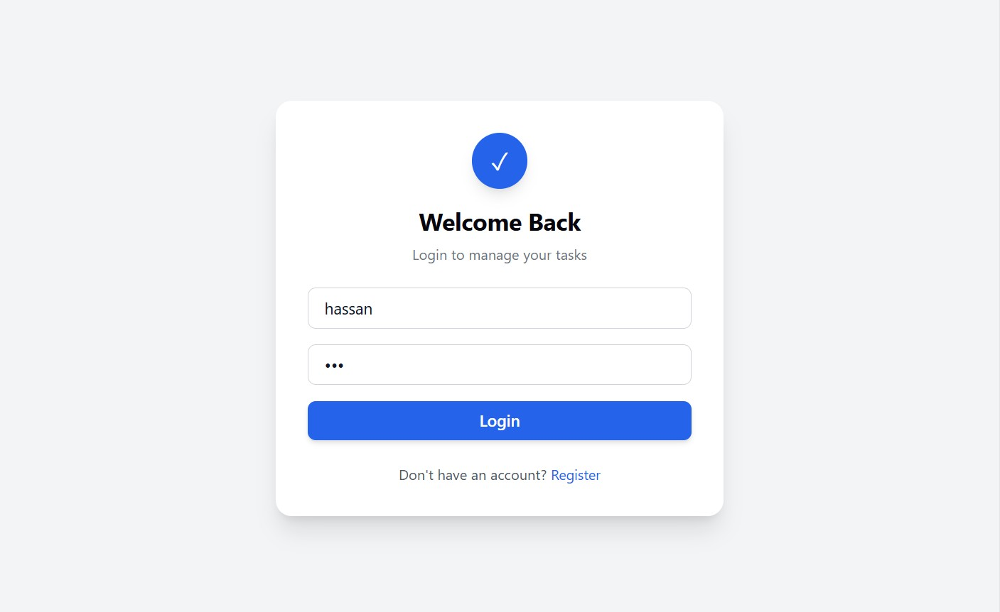
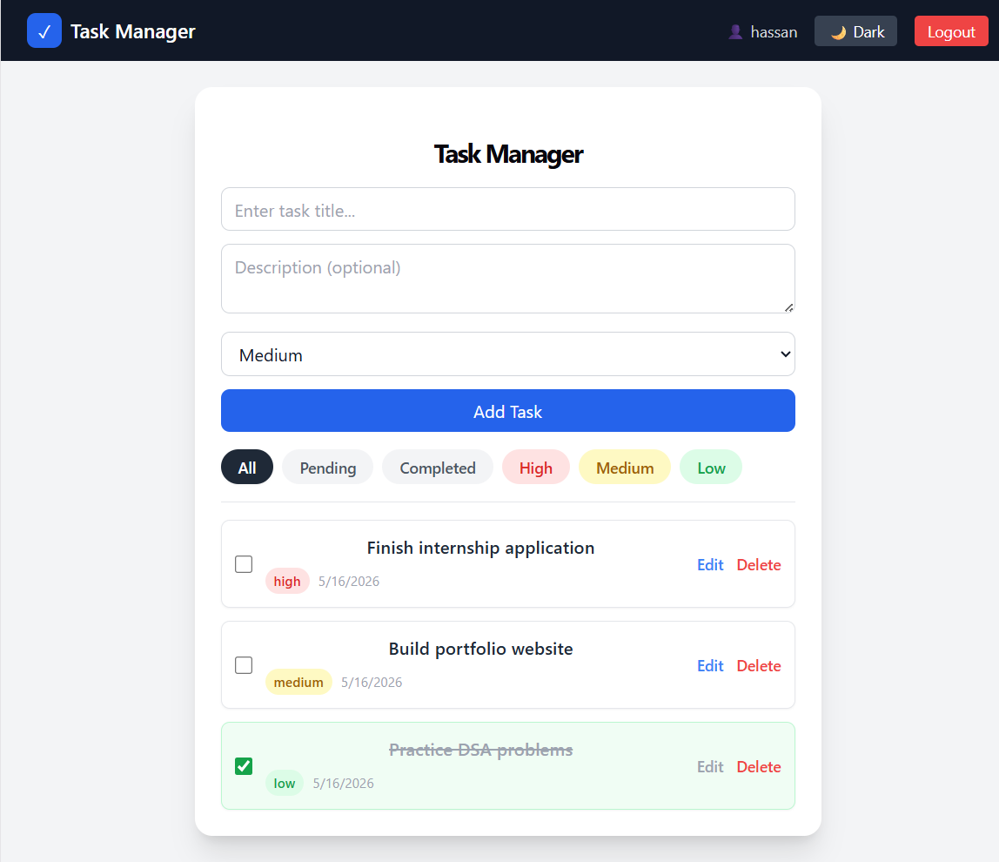
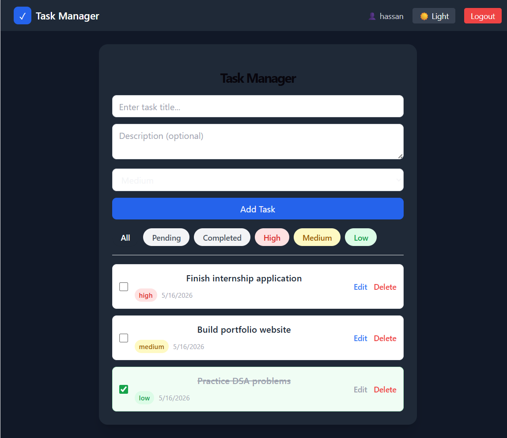

# 🚀 Full-Stack Task Manager

A secure full-stack Task Manager application built using **React** and **FastAPI**, featuring JWT authentication, multi-user task isolation, priority management, and dark mode support.

---

## 🛠 Tech Stack

- ⚛️ React (Vite + Tailwind CSS)
- 🚀 FastAPI
- 🗄️ SQLite + SQLAlchemy
- 🔐 JWT Authentication (OAuth2 Password Flow)
- 🌙 Dark Mode Support

---

## 🔥 Features

✅ User Registration & Login (JWT Authentication)  
✅ Protected API Routes  
✅ Multi-user Task Isolation  
✅ Create / Update / Delete Tasks  
✅ Task Priority (Low / Medium / High)  
✅ Task Filtering  
✅ Created & Updated Timestamps  
✅ Persistent Dark Mode  
✅ Responsive UI  

---

## 🏗 Backend Setup

```bash
cd backend
python -m venv venv
venv\Scripts\activate
pip install -r requirements.txt
uvicorn app.main:app --reload
```

Backend runs at:

```
http://127.0.0.1:8000
```

---

## 🎨 Frontend Setup

```bash
cd frontend
npm install
npm run dev
```

Frontend runs at:

```
http://localhost:5173
```

---

## 🔐 Authentication Flow

1. Register a new user  
2. Login  
3. JWT token stored in localStorage  
4. All task routes are protected  
5. Each user can only see their own tasks  

---

## 🌙 Dark Mode

Theme preference is saved in localStorage and persists across refresh.

---

## 📁 Project Structure

```
backend/
frontend/
screenshots/
```

---

## 📸 Screenshots

### 🔐 Login


### 📋 Dashboard


### 🌙 Dark Mode


---

## 📌 Future Improvements

- 🚀 Deployment (Render + Vercel)
- 👤 Profile Page
- 🔍 Search & Sorting
- 📊 Task Statistics

---

## 📝 License

This project is licensed under the MIT License.